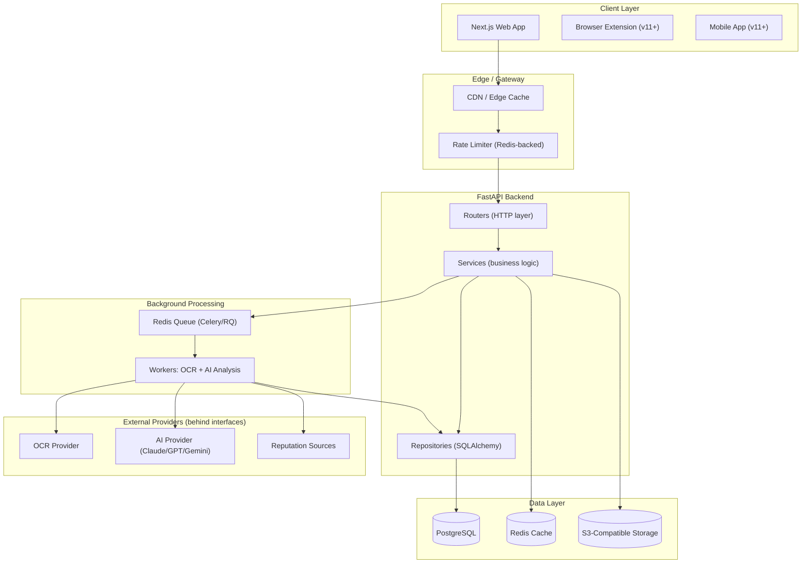
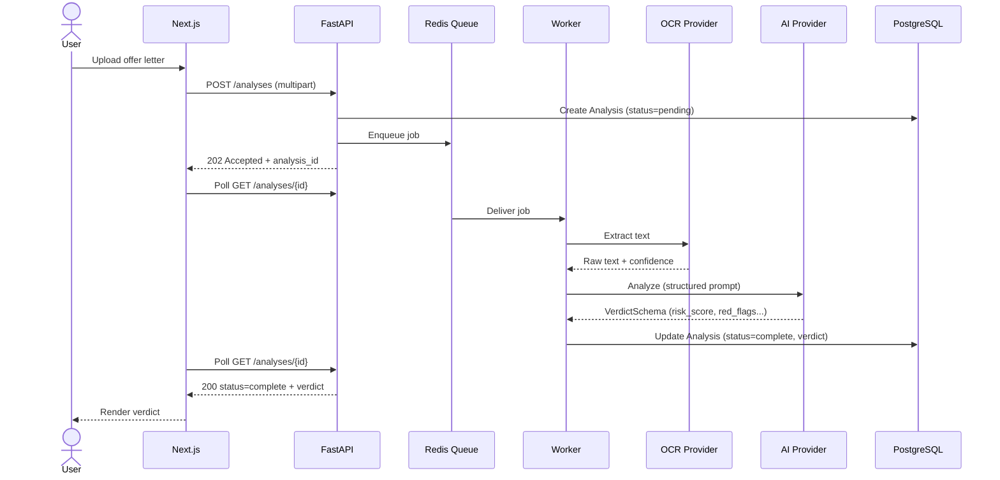
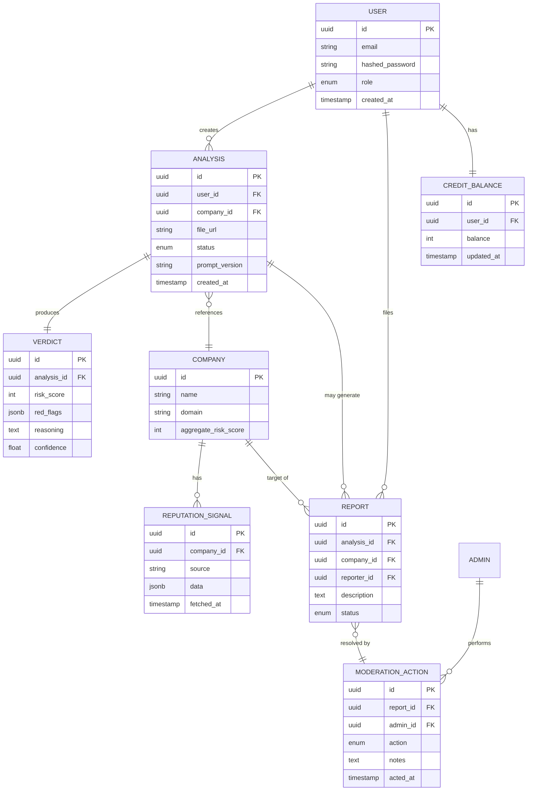

## Architecture

This document describes the system design of OfferLeaks: layering, data flow, entity relationships, provider interfaces, and deliberate scope boundaries.

For product direction see [Roadmap](./roadmap.md); for what's actually implemented and verified see [CHANGELOG.md](../CHANGELOG.md).

### Layering

The backend follows a clean/hexagonal-style layering, adapted for FastAPI:

```
routers (HTTP layer, thin)
  → services (business logic, framework-agnostic)
    → repositories (DB access, SQLAlchemy)
    → providers (external services: AI, OCR, reputation — behind interfaces)
```

External services (AI provider, OCR provider, reputation sources) are never called directly from business logic — they're accessed only through their interface, so a provider can be swapped or added without touching the services that depend on it.

### System Diagram



> Components under **Client** marked `v11+` (browser extension, mobile app) and the reputation-source integration are planned, not implemented.

### Core Data Flow (Upload → Verdict)



OCR and AI analysis run as an **asynchronous background job** (Redis queue + worker), never inline in the request/response cycle — documents can take well beyond a reasonable HTTP timeout to process, so the frontend polls the analysis endpoint until a verdict is ready.

### Entity Relationships (MVP scope)



### AI Provider Interface

```
AIProvider (abstract interface)
  ├── analyze_offer_letter(text, metadata) -> VerdictSchema
  └── AnthropicProvider / OpenAIProvider / GeminiProvider (implementations)
```

- Every AI call returns a typed `VerdictSchema` (Pydantic) — `risk_score`, `red_flags: list[RedFlag]`, `reasoning`, `confidence` — using each vendor's native structured-output/tool-calling mode rather than parsing free text. A parsing failure surfaces as a typed error, not a silent bad verdict.
- Prompts are versioned files (e.g. `prompts/offer_letter_v1.md`), and the version used is persisted with every stored verdict.
- The planned MVP model choice is Claude for the analysis step, chosen for structured-output reliability on a reasoning-heavy task; the interface is model-agnostic so this is a config change, not a rewrite.
- On provider error or timeout: retry once, then degrade to a "manual review pending" state rather than fabricate a low-confidence verdict.

### Deferred / Explicitly Out of Scope (for now)

- Dedicated vector database — semantic similarity search (for catching reused scam templates) will use the `pgvector` extension on the existing PostgreSQL instance until scale justifies a dedicated vector DB.
- Kubernetes / multi-region infrastructure.
- Browser extension, mobile app, WhatsApp bot, public API — planned for Version 11+.
- Multi-language support — English-only at MVP; i18n scaffolding added structurally but not populated.
- Multi-cloud hosting.
- Automated multi-model A/B testing infrastructure — the provider interface supports swapping models, but comparison tooling is a later optimization.

---

## Tech Stack

| Layer                | Technology                                        | Purpose                                                                                              |
| -------------------- | ------------------------------------------------- | ---------------------------------------------------------------------------------------------------- |
| **Frontend**         | Next.js (App Router) + TypeScript                 | Web application                                                                                      |
|                      | TailwindCSS + shadcn/ui                           | Styling and owned, customizable UI components (verdict badges, risk visualizations)                  |
|                      | TanStack Query                                    | Server-state management, polling long-running analysis jobs                                          |
|                      | Zustand                                           | Lightweight global client state (auth state, upload state, UI state)                                 |
|                      | React Hook Form + Zod                             | Form handling and schema validation                                                                  |
| **Backend**          | FastAPI (Python)                                  | Async-native API framework                                                                           |
|                      | SQLAlchemy                                        | Database access layer (repositories)                                                                 |
|                      | Pydantic v2                                       | Request/response validation and structured AI output parsing                                         |
| **Database**         | PostgreSQL                                        | Primary relational store; `JSONB` for semi-structured data; `pgvector` planned for future embeddings |
| **Cache / Queue**    | Redis                                             | Session/rate-limit store, Celery/RQ broker, reputation-lookup cache                                  |
| **Object Storage**   | S3-compatible storage (Cloudflare R2 at MVP)      | Uploaded offer letters and extracted images                                                          |
| **Background Jobs**  | Celery or RQ (Redis-backed)                       | OCR and AI analysis workers                                                                          |
| **OCR**              | Google Document AI                                | Text/field extraction from uploaded documents, behind an `OCRProvider` interface                     |
| **AI**               | Claude (MVP), pluggable to GPT / Gemini           | Offer-letter analysis, behind an `AIProvider` interface                                              |
| **Authentication**   | Auth.js (NextAuth)                                | Google OAuth + email/password on the frontend; FastAPI independently verifies issued JWTs            |
| **Monorepo**         | Turborepo                                         | Shared TS types, shared UI components, shared lint/env config, cached/parallel task execution        |
| **Deployment (MVP)** | Railway (API, Postgres, Redis) + Vercel (Next.js) | Zero-ops, usage-based hosting for a pre-revenue product                                              |

<!-- TODO: Confirm final choice of background job library (Celery vs RQ) -->

---

## Project Structure

```plaintext
.
├── apps/
│   ├── web/                 # Next.js frontend (App Router)
│   └── api/                 # FastAPI backend
│
├── docs/
│   ├── getting-started.md   # Local development setup
│   ├── roadmap.md           # Product roadmap
│   └── architecture.md      # System architecture & technical decisions
│
├── packages/                # Shared monorepo packages
├── docker-compose.yml       # Local infrastructure
├── SECURITY.md              # Security policy
├── CHANGELOG.md             # Shipped version history
├── CONTRIBUTING.md          # Contribution guidelines
└── LICENSE                  # Project license
```

The Python API's own tooling (`ruff`, `mypy`, `pytest`) is orchestrated through Turborepo via a thin `package.json` wrapper in `apps/api`, while its dependency management stays in its own Python toolchain (uv).

<!-- TODO: Expand with the full directory tree once Future Versions are implemented -->
